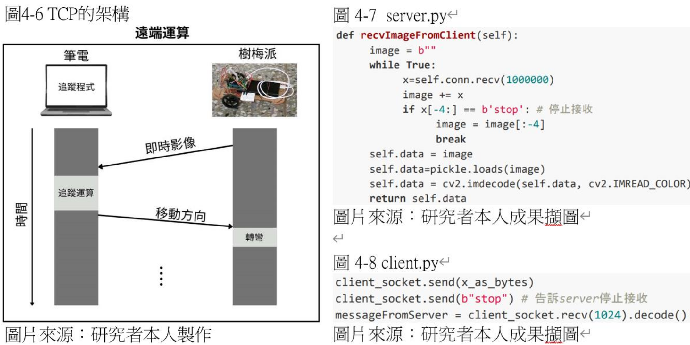

# Raspberry Pi Auto-Following Car

## Detail

| ------------- |:-------------:|
| Project       | Raspberry Pi Auto-Following Car |
| Duration      | Nov. 2023 ~ Mar. 2024  |
| Advisor       | Yi-Yuan Chen (陳顗元)
| Team          | Zong-Han Lin (林宗翰, Hardware) & Jay Wang (王宥傑, Software) |
| My Role       | Sole Software Developer (Python, Computer Vision, Networking) |

    
    <em>A distributed Client-Server architecture using TCP/IP sockets to offload real-time image tracking to a laptop.</em>

## Introduction

This project implements an autonomous car-following simulation using a Raspberry Pi 4B and Python. The system integrates computer vision and sensor data to control servo motors in real-time.

* **Object Tracking (Computer Vision)**

    The camera captures environmental imagery, which is analyzed via OpenCV to identify the target vehicle’s position and motion status relative to the frame's center.

* **Motion Control Algorithm** 

    The car’s movement is determined by the relative direction of the target. I implemented a control loop that calculates the horizontal offset and adjusts the steering angle accordingly to maintain a center lock.

* **Distance Sensing**

    An ultrasonic sensor precisely measures the distance to the target. This ensures a safe following distance and maintains an accurate trajectory.

## Challenges
* **Performance Optimization (Client-Server Architecture)**

    The Raspberry Pi 4 CPU struggled with the computational load of real-time object tracking, causing significant video lag.
    - **Solution:**
    
        I engineered a distributed system using TCP/IP Sockets. The Pi acts as a client, streaming raw video frames to a high-performance laptop (Server) for processing. The laptop calculates the steering logic and returns lightweight commands to the Pi, solving the latency issue.

* **Stability Control**

    Initially, the car moved in an unstable "S-curve" pattern because it over-corrected for minor movements. 
    - **Solution:** 
    
        I implemented a 30-pixel tolerance zone in the steering algorithm. If the target is within 30 pixels of the center, the software commands the car to move straight, resulting in a smooth, stable trajectory.

* **Safety Mechanisms**
    - **Solution:** 
    
        I integrated HC-SR04 ultrasonic sensors to constantly monitor the gap between vehicles. I wrote a safety interrupt function that triggers an automatic emergency stop if the distance falls below 20cm, overriding all other navigation commands.

<a href="https://github.com/jay1224-jay/Self_Driving_Car_with_Raspberry_pi" target="_blank">View source code on Github</a>

## Read Full Research Paper (Chinese PDF)

<object data="../pdf/self_driving_car.pdf" type="application/pdf" width="100%" height="700px">
    <embed src="../pdf/self_driving_car.pdf">
        
This browser does not support PDFs. Please download the PDF to view it: <a href="../pdf/self_driving_car.pdf">Download PDF</a>.

    </embed>
</object>

